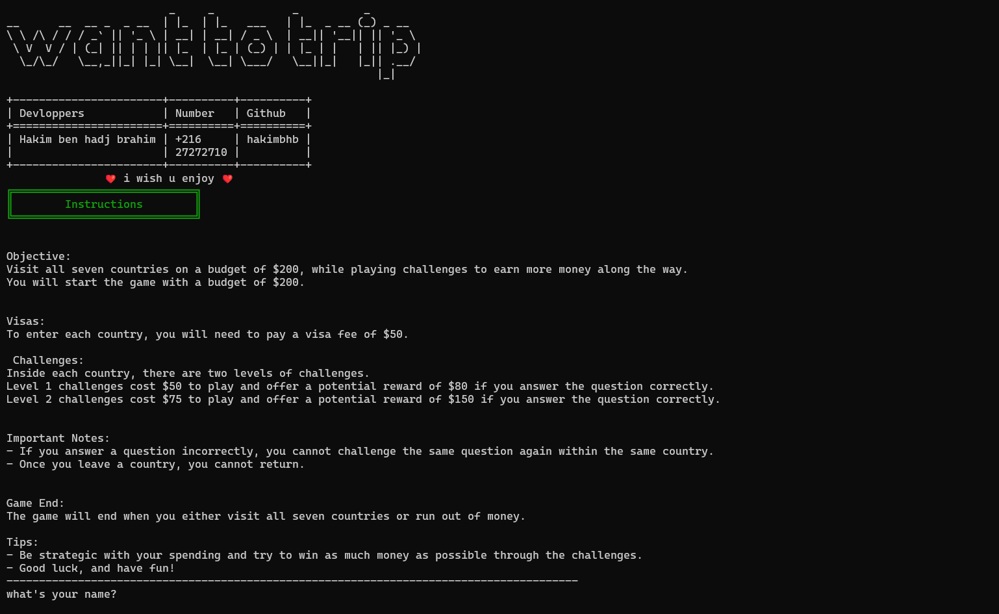
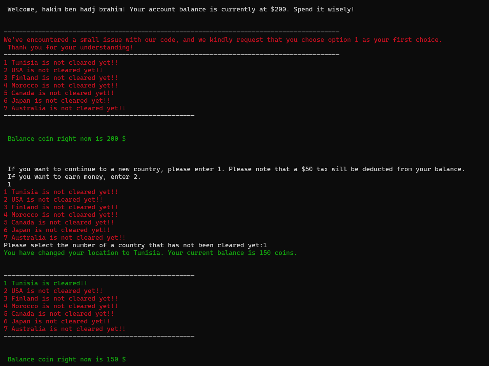
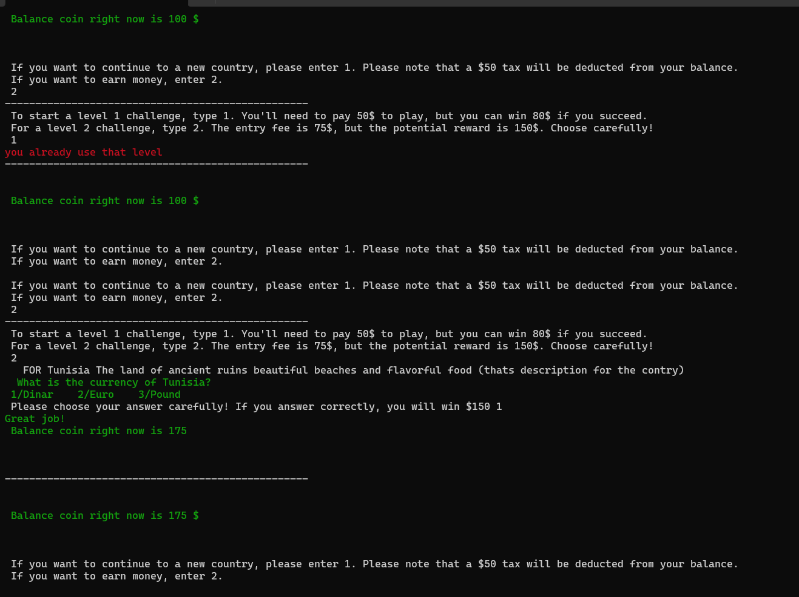

# Want to Trip!

#### Video Demo:  https://youtu.be/-AhdaYLiwQg

Welcome to Want to Trip!, a fun and exciting game that challenges you to visit seven countries on a budget of $200. This project was inspired by a board game created by a couple in Tunisia and developed into a program by Hakim Ben Hadj Brahim as part of the CS50x Python course. Special thanks go to the original creators for their fantastic game idea and to the CS50 team for their hard work on this course.

## Installation

To play Want to Trip!

## How to Play

When you start the game, you will be given a budget of $200 and your objective will be to visit all seven countries while playing challenges to earn more money along the way. Each country requires a visa fee of $50 to enter, and inside each country there are two levels of challenges. Level 1 challenges cost $50 to play and offer a potential reward of $80 if you answer the question correctly. Level 2 challenges cost $75 to play and offer a potential reward of $150 if you answer the question correctly.

If you answer a question incorrectly, you cannot challenge the same question again within the same country. Once you leave a country, you cannot return. The game will end when you either visit all seven countries or run out of money.

### Country List

The seven countries you will be visiting in this game are:

- Tunisia
- United States
- Finland
- Morocco
- Canada
- Japan
- Australia

Each country has its own unique challenges, so make sure to explore them all!

### Challenge Questions

The challenge questions in this game are based on a variety of topics, including geography, history, and pop culture. You will have a limited amount of time to answer each question, so think carefully and act quickly!

### Winning the Game

To win Want to Trip!, you will need to visit all seven countries while earning as much money as possible through the challenge questions. If you run out of money before visiting all seven countries, the game will be over.

## Contact Information

If you have any questions or feedback about Want to Trip!, please don't hesitate to contact me at bhbhakim123@gmail.com 

Github: hakimbhb

## LINK DOWNLOAD:

https://drive.google.com/file/d/1PjGLB0xrbq_1L5Q0DCPNpTgzM7vag8aJ/view?usp=drivesdk

# Screenshots []
  
  
  

## Acknowledgments

Special thanks to the original creators of the Want to Trip! board game for their fantastic game idea and to David J. Malan and the University of Harvard for their hard work on the CS50x course. This is my second course after CS50x, and as a student, I really enjoyed developing this project into a program for everyone to play.

https://www.facebook.com/wantotrip/videos/démo-du-jeu-de-société-wantotrip-le-tour-du-monde/3392577771065515/

## License

-This project is licensed under the MIT License - see the LICENSE.md file for details.
